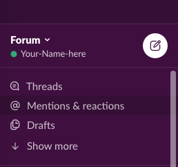
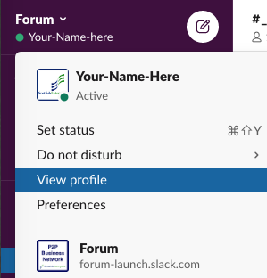
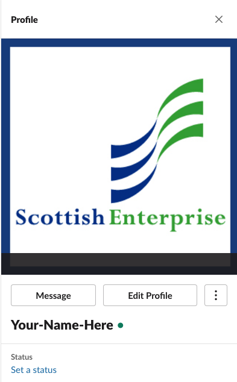
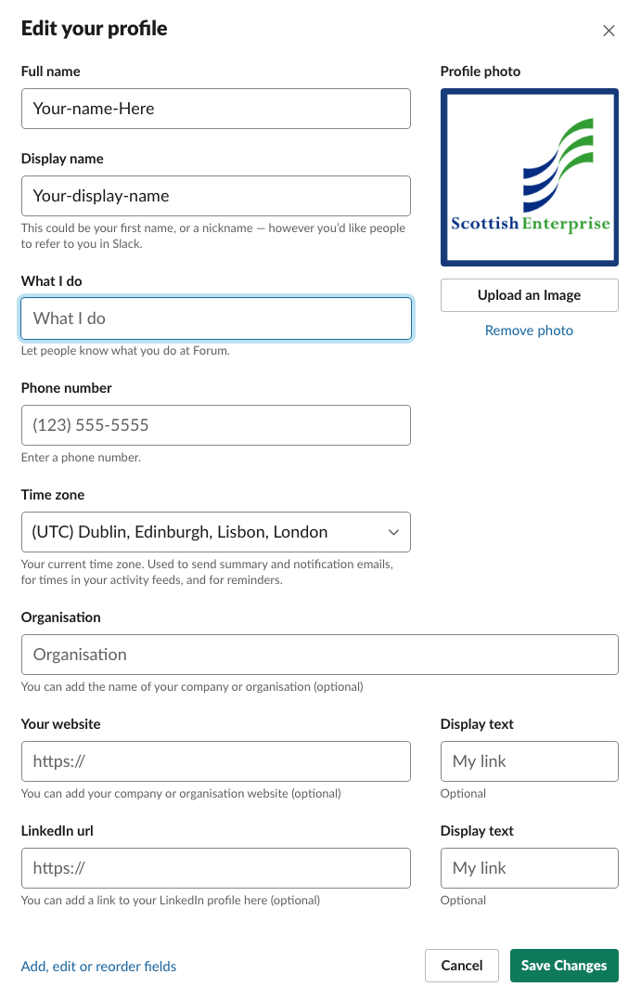

You should have received an invite via email.

1. sign up for your Slack account
2. accept our rules of engagements: when you first join, you will see a message from the Slack bot in the left side bar; read the message and select the button **I agree**
3. create your profile

**Go to the top left where your name appear**

**Select View profile**

**This will open a window in the right part of your screen**

**Select Edit Profile**

**Enter information about you**
- we won't display your full name or your email address
- most of the fields are not mandatory
- if you do not provide a picture, Slack will provide a random avatar

> Some information like **What I do**, or **your organisation/company's name** are optional, but telling a bit more about yourself encourage people to engage with you as they will know where you are speaking from

## You are ready!
Start engaging with other businesses

