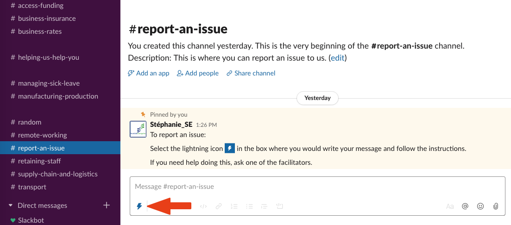
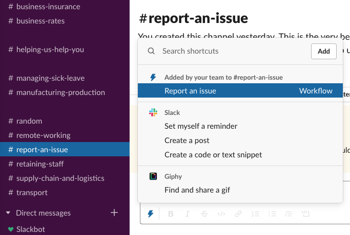

We are committed to providing an accessible and useful service for the Scottish Business community.

However, if you believe that things have gone wrong, please send your complaints or comments to the Facilitator team through the **#report-an-issue** channel.

We will try to respond to any complaint within five working days.

## To report an issue

1. go to the channel report-an-issue
2. look for the lightning icon in the box where you would write your message:

3. select the icon an you will see a menu with Report an issue

4. one you select it, a form will appear on screen

5. follow the instructions
